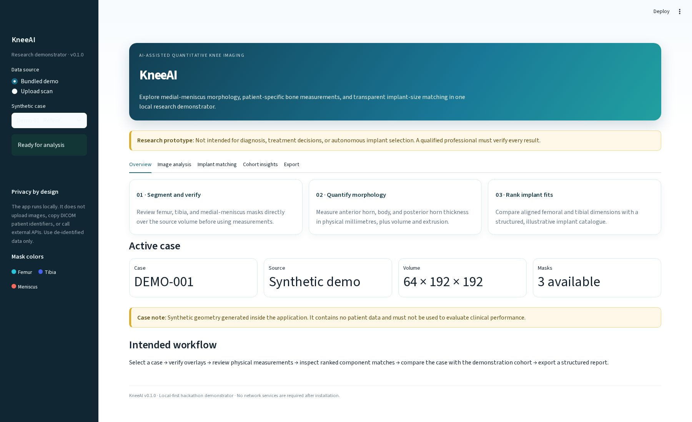
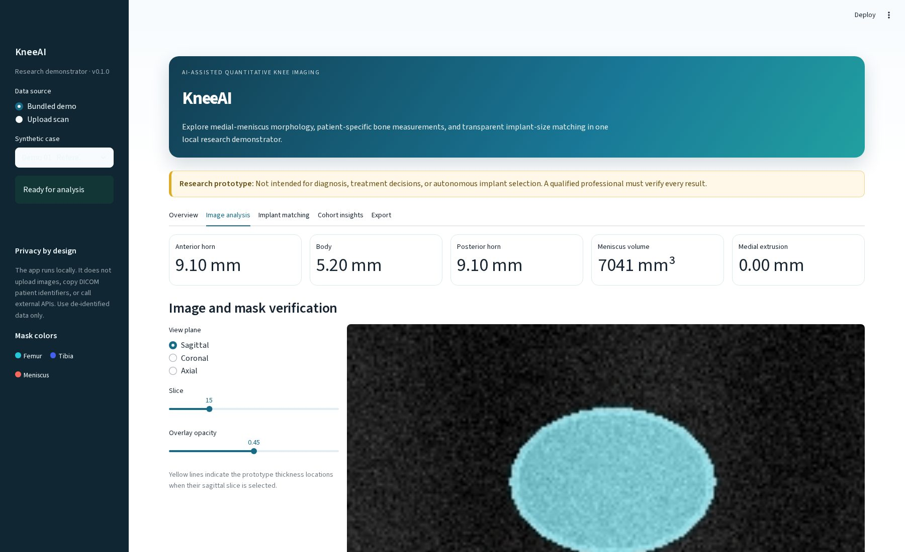
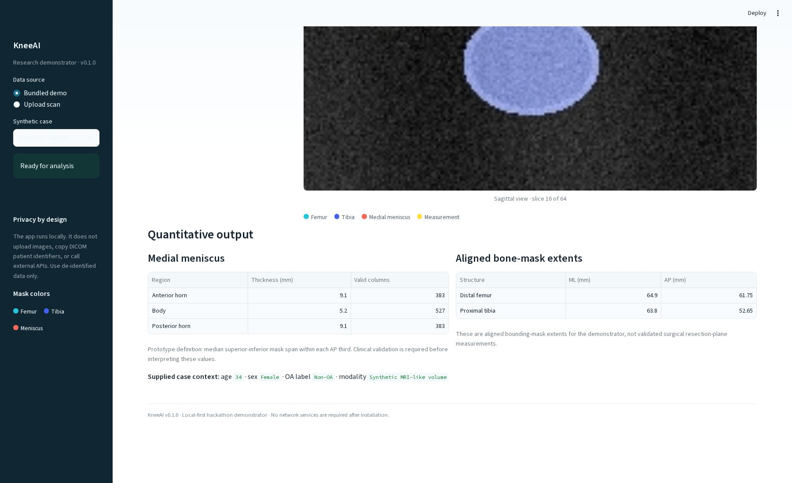
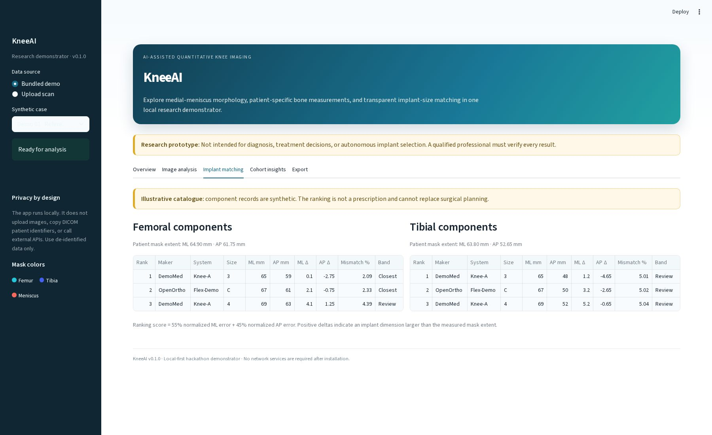
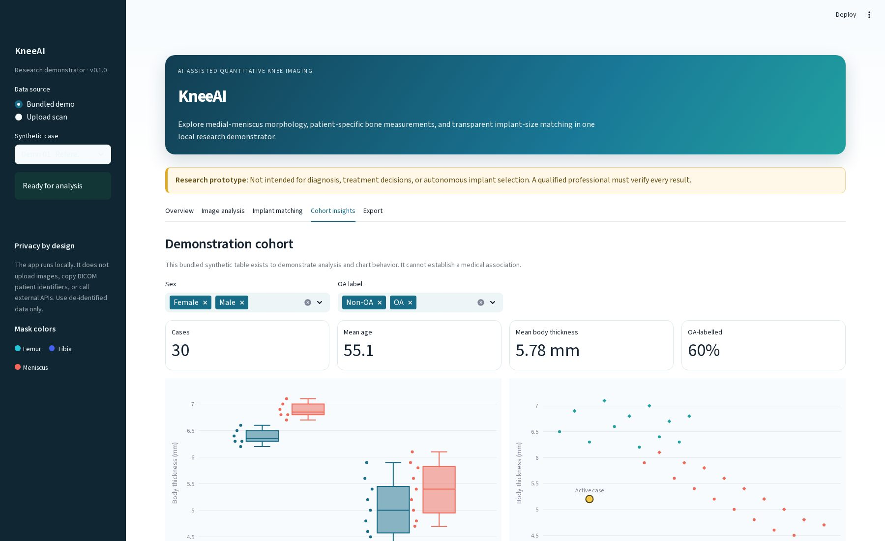
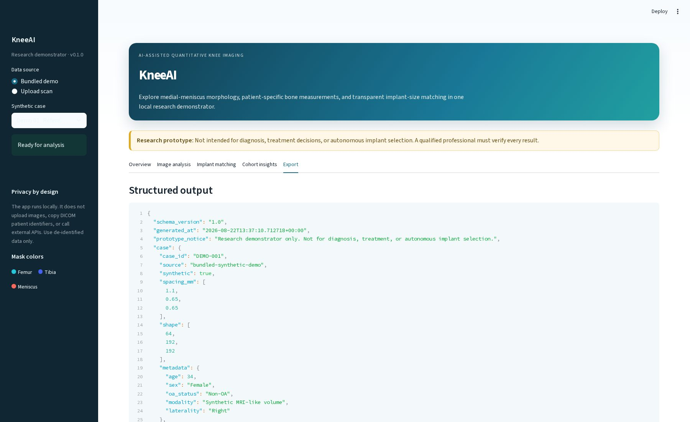
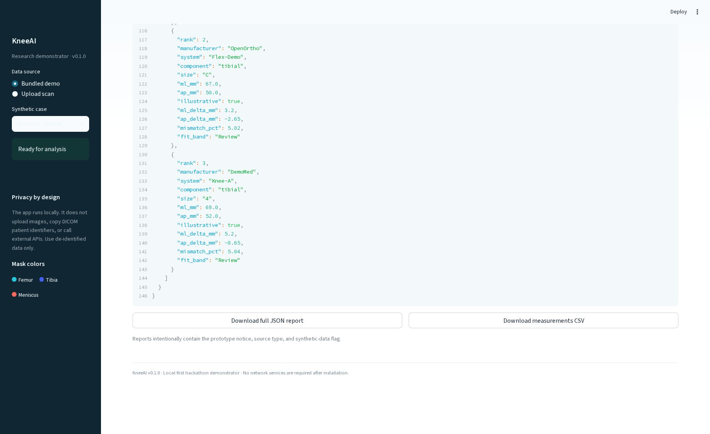

# KneeAI research demonstrator

KneeAI is a local-first web application built for the hackathon statement on
medial-meniscus assessment and patient-specific knee implant sizing. It runs in a
browser and includes synthetic, de-identified demo cases, mask verification,
physical measurements, cohort charts, illustrative component matching, and
JSON/CSV exports.

> **Prototype only:** This is not a medical device. It must not be used for
> diagnosis, treatment, surgical planning, or autonomous implant selection.

## Application output

These screenshots were captured from the bundled synthetic demo. No patient data
or external service is used.

[](docs/screenshots/01-overview.jpg)

<details>
<summary><strong>Open the complete output gallery</strong></summary>

| Image and mask verification | Quantitative measurements |
| --- | --- |
| [](docs/screenshots/02-image-analysis.jpg) | [](docs/screenshots/02-quantitative-output.jpg) |

| Implant matching | Cohort insights |
| --- | --- |
| [](docs/screenshots/03-implant-matching.jpg) | [](docs/screenshots/04-cohort-insights.jpg) |

| Structured export | Report downloads |
| --- | --- |
| [](docs/screenshots/05-export-report.jpg) | [](docs/screenshots/05-export-downloads.jpg) |

</details>

## Fastest way to run

Python 3.10 or newer is required. From this directory, run:

```bash
python start.py
```

`start.py` works on Windows, macOS, and Linux. On its first run it creates an
isolated `.venv`, installs the pinned dependencies, and starts the application.
Open <http://localhost:8501> if a browser does not open automatically.

`localhost` and `127.0.0.1` identify the same computer. Port `8501` is the
default; if it is already occupied, start on another port and open the URL shown
in the terminal, for example:

```bash
.venv/bin/python -m streamlit run app.py --server.address=127.0.0.1 --server.port=8502
```

Convenience launchers are also included:

- macOS/Linux: `./start.sh`
- Windows: double-click `start.bat`

## Docker option

Docker provides the most reproducible execution path:

```bash
docker compose up --build
```

Then open <http://localhost:8501>. To stop, press `Ctrl+C` and run
`docker compose down`.

## What works without external data

The three bundled cases are generated deterministically at runtime and contain:

- an MRI-like volume;
- femur, tibia, and medial-meniscus masks;
- age, sex, and supplied OA/non-OA demonstration labels;
- known voxel spacing in millimetres.

They exercise the entire application without internet, cloud accounts, patient
data, or GPU hardware. The implant catalogue and cohort table are explicitly
synthetic so they can be redistributed safely.

## Upload formats

The app accepts:

- `.npz` image-and-mask packages;
- 3-D NIfTI (`.nii` or `.nii.gz`);
- one DICOM file;
- a ZIP containing a DICOM series.

DICOM and NIfTI uploads are view-only because an unvalidated medical model is not
bundled. A pre-segmented NPZ package enables the full measurement workflow. It
must contain arrays using the `(medial-lateral, superior-inferior,
anterior-posterior)` convention:

```python
import numpy as np

np.savez_compressed(
    "case.npz",
    image=image_volume,             # required, 3-D
    spacing=np.array([1.1, .65, .65]),  # millimetres, required for real measurement
    femur=femur_mask,
    tibia=tibia_mask,
    meniscus=medial_meniscus_mask,
)
```

All masks must have the same shape as `image`. Uploaded arrays are handled in
memory and are not persisted by the application.

## Measurement definitions

For the transparent prototype, the medial meniscus is divided into three equal
AP regions. Thickness is the median superior-inferior occupied mask span in each
region. Volume uses mask voxels and physical spacing. Extrusion is the mask's
medial extension beyond the aligned tibial-mask boundary.

Bone dimensions are aligned mask extents. They are **not** surgical resection-
plane measurements. Production use requires clinician-approved landmarks,
orientation standardization, failure detection, manual correction, and validation
against expert measurements.

The component matcher reports the three closest illustrative records using:

```text
55% normalized mediolateral error + 45% normalized anteroposterior error
```

## Real AI model integration

The `models/` directory documents the model boundary. A real implementation
should export a validated segmentation model to ONNX, reproduce the model's exact
preprocessing, transform masks back into the original physical coordinate space,
and reject unsupported modalities or acquisition protocols. Expected output mask
names are `femur`, `tibia`, and `meniscus`.

Do not label a thresholding heuristic as medical AI. Model performance must be
reported on held-out data using segmentation and measurement metrics such as
Dice, HD95, thickness MAE, and agreement with qualified manual readers.

## Tests

After the environment has been installed:

```bash
.venv/bin/python -m pip install -r requirements-dev.txt
.venv/bin/python -m pytest
```

On Windows use `.venv\Scripts\python.exe` instead.

## Project layout

```text
app.py                  Streamlit user interface
knee_ai/                Image I/O, demo generation, measurements, matching
data/                    Synthetic implant catalogue and cohort
models/                  Validated-model integration point
tests/                   Unit and pipeline tests
docs/screenshots/        Application output gallery used by this README
start.py                 Cross-platform first-run launcher
Dockerfile, compose.yaml Reproducible container deployment
```
